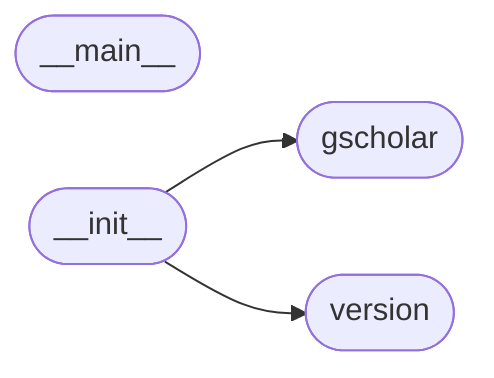

# Code Overview

[_Documentation generated by Documatic_](https://www.documatic.com)

<!---Documatic-section-Codebase Structure Python-start--->
## Codebase Structure Python

The codebase has a flat structure, with 4 code files.

<!---Documatic-block-system_architecture-start--->

<!---Documatic-block-system_architecture-end--->

# #
<!---Documatic-section-Codebase Structure Python-end--->

<!---Documatic-section-Key Objects-start--->
## Key Objects

There are exposed imports at level-0
from the source directory (gscholar)

<!---Documatic-block-gscholar-start--->

	
<code>gscholar</code> (Click to Expand!)

* `gscholar.gscholar.FORMAT_BIBTEX`
* `gscholar.gscholar.FORMAT_ENDNOTE`
* `gscholar.gscholar.FORMAT_REFMAN`
* `gscholar.gscholar.FORMAT_WENXIANWANG`
* `gscholar.gscholar.GOOGLE_SCHOLAR_URL`
* `gscholar.gscholar.HEADERS`
* `gscholar.gscholar._get_bib_element`
* `gscholar.gscholar.convert_pdf_to_txt`
* `gscholar.gscholar.get_links`
* `gscholar.gscholar.logger`
* `gscholar.gscholar.pdflookup`
* `gscholar.gscholar.query`
* `gscholar.gscholar.rename_file`
* `gscholar.version.__VERSION__`

<!---Documatic-block-gscholar-end--->

# #
<!---Documatic-section-Key Objects-end--->

<!---Documatic-section-Important Functions-start--->
## Important Functions

<!---Documatic-block-important_funcs-start--->
<!---Documatic-block-most_used_funcs-start--->
### Most Utilised Functions

* [gscholar.gscholar._get_bib_element](4-gscholar_gscholar.md#gscholar.gscholar._get_bib_element) (1 times)
* [gscholar.gscholar.convert_pdf_to_txt](4-gscholar_gscholar.md#gscholar.gscholar.convert_pdf_to_txt) (1 times)
* [gscholar.gscholar.get_links](4-gscholar_gscholar.md#gscholar.gscholar.get_links) (1 times)
* gscholar.gscholar.logger (1 times)
* [gscholar.gscholar.pdflookup](4-gscholar_gscholar.md#gscholar.gscholar.pdflookup) (1 times)
* [gscholar.gscholar.query](4-gscholar_gscholar.md#gscholar.gscholar.query) (1 times)
* [gscholar.gscholar.rename_file](4-gscholar_gscholar.md#gscholar.gscholar.rename_file) (1 times)
<!---Documatic-block-most_used_funcs-end--->

<!---Documatic-block-end_user_funcs-start--->
### End User Exposed Functions

* gscholar.gscholar.FORMAT_WENXIANWANG
* [gscholar.gscholar.convert_pdf_to_txt](4-gscholar_gscholar.md#gscholar.gscholar.convert_pdf_to_txt)
* gscholar.gscholar.FORMAT_ENDNOTE
* [gscholar.gscholar.pdflookup](4-gscholar_gscholar.md#gscholar.gscholar.pdflookup)
* gscholar.gscholar.GOOGLE_SCHOLAR_URL
* gscholar.version.__VERSION__
* [gscholar.gscholar.get_links](4-gscholar_gscholar.md#gscholar.gscholar.get_links)
* gscholar.gscholar.FORMAT_BIBTEX
* gscholar.gscholar.logger
* [gscholar.gscholar.query](4-gscholar_gscholar.md#gscholar.gscholar.query)
* [gscholar.gscholar._get_bib_element](4-gscholar_gscholar.md#gscholar.gscholar._get_bib_element)
* gscholar.gscholar.HEADERS
* gscholar.gscholar.FORMAT_REFMAN
* [gscholar.gscholar.rename_file](4-gscholar_gscholar.md#gscholar.gscholar.rename_file)
* gscholar.__main__.main
<!---Documatic-block-end_user_funcs-end--->
<!---Documatic-block-important_funcs-end--->

# #
<!---Documatic-section-Important Functions-end--->

[_Documentation generated by Documatic_](https://www.documatic.com)