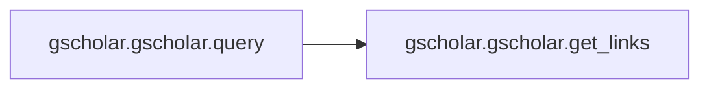
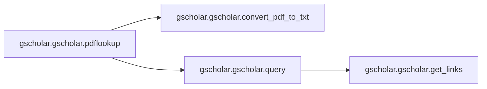
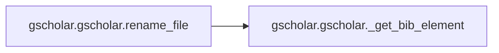

# Gscholar Gscholar

[_Documentation generated by Documatic_](https://www.documatic.com)

<!---Documatic-section-Codebase Structure-start--->
## Codebase Structure

<!---Documatic-block-system_architecture-start--->
```mermaid
None
```
<!---Documatic-block-system_architecture-end--->

# #
<!---Documatic-section-Codebase Structure-end--->

<!---Documatic-section-gscholar.gscholar.query-start--->
## [gscholar.gscholar.query](4-gscholar_gscholar.md#gscholar.gscholar.query)

<!---Documatic-section-query-start--->


### Object Calls

* [gscholar.gscholar.get_links](4-gscholar_gscholar.md#gscholar.gscholar.get_links)

<!---Documatic-block-gscholar.gscholar.query-start--->
<details>
	<summary><code>gscholar.gscholar.query</code> code snippet</summary>

```python
def query(searchstr, outformat=FORMAT_BIBTEX, allresults=False):
    logger.debug('Query: {sstring}'.format(sstring=searchstr))
    searchstr = '/scholar?q=' + quote(searchstr)
    url = GOOGLE_SCHOLAR_URL + searchstr
    header = HEADERS
    header['Cookie'] = 'GSP=CF=%d' % outformat
    request = Request(url, headers=header)
    response = urlopen(request)
    html = response.read()
    html = html.decode('utf8')
    tmp = get_links(html, outformat)
    result = list()
    if not allresults:
        tmp = tmp[:1]
    for link in tmp:
        url = GOOGLE_SCHOLAR_URL + link
        request = Request(url, headers=header)
        response = urlopen(request)
        bib = response.read()
        bib = bib.decode('utf8')
        result.append(bib)
    return result
```
</details>
<!---Documatic-block-gscholar.gscholar.query-end--->
<!---Documatic-section-query-end--->

# #
<!---Documatic-section-gscholar.gscholar.query-end--->

<!---Documatic-section-gscholar.gscholar.get_links-start--->
## [gscholar.gscholar.get_links](4-gscholar_gscholar.md#gscholar.gscholar.get_links)

<!---Documatic-section-get_links-start--->
<!---Documatic-block-gscholar.gscholar.get_links-start--->
<details>
	<summary><code>gscholar.gscholar.get_links</code> code snippet</summary>

```python
def get_links(html, outformat):
    base_url = 'https://scholar.googleusercontent.com'
    if outformat == FORMAT_BIBTEX:
        refre = re.compile(f'<a href="{base_url}(/scholar\\.bib\\?[^"]*)')
    elif outformat == FORMAT_ENDNOTE:
        refre = re.compile(f'<a href="{base_url}(/scholar\\.enw\\?[^"]*)"')
    elif outformat == FORMAT_REFMAN:
        refre = re.compile(f'<a href="{base_url}(/scholar\\.ris\\?[^"]*)"')
    elif outformat == FORMAT_WENXIANWANG:
        refre = re.compile(f'<a href="{base_url}(/scholar\\.ral\\?[^"]*)"')
    reflist = refre.findall(html)
    reflist = [re.sub('&(%s);' % '|'.join(name2codepoint), lambda m: chr(name2codepoint[m.group(1)]), s) for s in reflist]
    return reflist
```
</details>
<!---Documatic-block-gscholar.gscholar.get_links-end--->
<!---Documatic-section-get_links-end--->

# #
<!---Documatic-section-gscholar.gscholar.get_links-end--->

<!---Documatic-section-gscholar.gscholar.convert_pdf_to_txt-start--->
## [gscholar.gscholar.convert_pdf_to_txt](4-gscholar_gscholar.md#gscholar.gscholar.convert_pdf_to_txt)

<!---Documatic-section-convert_pdf_to_txt-start--->
<!---Documatic-block-gscholar.gscholar.convert_pdf_to_txt-start--->
<details>
	<summary><code>gscholar.gscholar.convert_pdf_to_txt</code> code snippet</summary>

```python
def convert_pdf_to_txt(pdf, startpage=None):
    if startpage is not None:
        startpageargs = ['-f', str(startpage)]
    else:
        startpageargs = []
    stdout = subprocess.Popen(['pdftotext', '-q'] + startpageargs + [pdf, '-'], stdout=subprocess.PIPE).communicate()[0]
    if not isinstance(stdout, str):
        stdout = stdout.decode()
    return stdout
```
</details>
<!---Documatic-block-gscholar.gscholar.convert_pdf_to_txt-end--->
<!---Documatic-section-convert_pdf_to_txt-end--->

# #
<!---Documatic-section-gscholar.gscholar.convert_pdf_to_txt-end--->

<!---Documatic-section-gscholar.gscholar.pdflookup-start--->
## [gscholar.gscholar.pdflookup](4-gscholar_gscholar.md#gscholar.gscholar.pdflookup)

<!---Documatic-section-pdflookup-start--->


### Object Calls

* [gscholar.gscholar.convert_pdf_to_txt](4-gscholar_gscholar.md#gscholar.gscholar.convert_pdf_to_txt)
* [gscholar.gscholar.query](4-gscholar_gscholar.md#gscholar.gscholar.query)

<!---Documatic-block-gscholar.gscholar.pdflookup-start--->
<details>
	<summary><code>gscholar.gscholar.pdflookup</code> code snippet</summary>

```python
def pdflookup(pdf, allresults, outformat, startpage=None):
    txt = convert_pdf_to_txt(pdf, startpage)
    txt = re.sub('\\W', ' ', txt)
    words = txt.strip().split()[:20]
    gsquery = ' '.join(words)
    bibtexlist = query(gsquery, outformat, allresults)
    return bibtexlist
```
</details>
<!---Documatic-block-gscholar.gscholar.pdflookup-end--->
<!---Documatic-section-pdflookup-end--->

# #
<!---Documatic-section-gscholar.gscholar.pdflookup-end--->

<!---Documatic-section-gscholar.gscholar._get_bib_element-start--->
## [gscholar.gscholar._get_bib_element](4-gscholar_gscholar.md#gscholar.gscholar._get_bib_element)

<!---Documatic-section-_get_bib_element-start--->
<!---Documatic-block-gscholar.gscholar._get_bib_element-start--->
<details>
	<summary><code>gscholar.gscholar._get_bib_element</code> code snippet</summary>

```python
def _get_bib_element(bibitem, element):
    lst = [i.strip() for i in bibitem.split('\n')]
    for i in lst:
        if i.startswith(element):
            value = i.split('=', 1)[-1]
            value = value.strip()
            while value.endswith(','):
                value = value[:-1]
            while value.startswith('{') or value.startswith('"'):
                value = value[1:-1]
            return value
    return None
```
</details>
<!---Documatic-block-gscholar.gscholar._get_bib_element-end--->
<!---Documatic-section-_get_bib_element-end--->

# #
<!---Documatic-section-gscholar.gscholar._get_bib_element-end--->

<!---Documatic-section-gscholar.gscholar.rename_file-start--->
## [gscholar.gscholar.rename_file](4-gscholar_gscholar.md#gscholar.gscholar.rename_file)

<!---Documatic-section-rename_file-start--->


### Object Calls

* [gscholar.gscholar._get_bib_element](4-gscholar_gscholar.md#gscholar.gscholar._get_bib_element)

<!---Documatic-block-gscholar.gscholar.rename_file-start--->
<details>
	<summary><code>gscholar.gscholar.rename_file</code> code snippet</summary>

```python
def rename_file(pdf, bibitem):
    year = _get_bib_element(bibitem, 'year')
    author = _get_bib_element(bibitem, 'author')
    if author:
        author = author.split(',')[0]
    title = _get_bib_element(bibitem, 'title')
    elem = [i for i in (year, author, title) if i]
    filename = '-'.join(elem) + '.pdf'
    newfile = pdf.replace(os.path.basename(pdf), filename)
    logger.info('Renaming {in_} to {out}'.format(in_=pdf, out=newfile))
    os.rename(pdf, newfile)
```
</details>
<!---Documatic-block-gscholar.gscholar.rename_file-end--->
<!---Documatic-section-rename_file-end--->

# #
<!---Documatic-section-gscholar.gscholar.rename_file-end--->

[_Documentation generated by Documatic_](https://www.documatic.com)